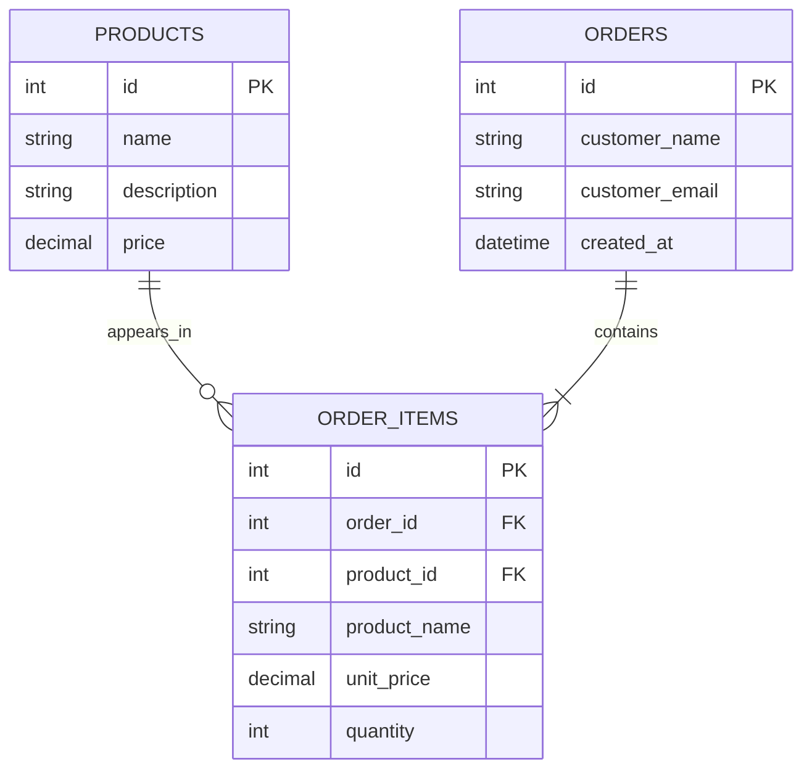

# ER Diagram

```mermaid
erDiagram
    PRODUCTS ||--o{ ORDER_ITEMS : appears_in
    ORDERS ||--|{ ORDER_ITEMS : contains

    PRODUCTS {
        int id PK
        string name
        string description
        decimal price
    }

    ORDERS {
        int id PK
        string customer_name
        string customer_email
        datetime created_at
    }

    ORDER_ITEMS {
        int id PK
        int order_id FK
        int product_id FK
        string product_name
        decimal unit_price
        int quantity
    }
```
